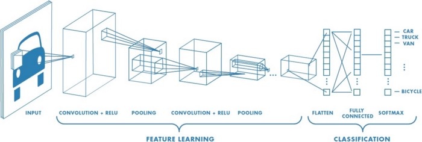

**TRƯỜNG ĐẠI HỌC XÂY DỰNG HÀ NỘI**

**KHOA CÔNG NGHỆ THÔNG TIN**

 

**ĐỒ ÁN THỊ GIÁC MÁY TÍNH**

**ĐỀ TÀI : PHÁT HIỆN VÀ NHẬN DIỆN BIỂN BÁO GIAO THÔNG**

Giảng viên hướng dẫn : Ths. Nguyễn Đình Quý 

**Nhóm : 14**

**Sinh viên : Trương Đức Việt -- 0295867 -- 67CS2**

# TÓM TẮT

Trong bối cảnh công nghệ trí tuệ nhân tạo và thị giác máy tính phát
triển mạnh mẽ, việc ứng dụng các kỹ thuật học sâu vào giải quyết những
bài toán thực tiễn ngày càng trở nên phổ biến. Một trong những ứng dụng
quan trọng là phát hiện và nhận diện biển báo giao thông tự động, đóng
góp trực tiếp vào việc nâng cao an toàn giao thông, hỗ trợ người lái và
phát triển hệ thống giao thông thông minh. Đặc biệt tại Việt Nam, với
tình hình giao thông phức tạp, việc có một hệ thống cảnh báo sớm dựa
trên nhận diện biển báo là vô cùng cần thiết. Tuy nhiên, việc xây dựng
một hệ thống như vậy phải đối mặt với nhiều thách thức như sự đa dạng
của các loại biển báo, điều kiện ánh sáng, thời tiết thay đổi và yêu cầu
xử lý thời gian thực. Đồ án này tập trung vào việc nghiên cứu và xây
dựng một hệ thống có khả năng phá hiện và nhận diện các loại biển báo
giao thông phổ biến. Phương pháp chính bao gồm việc tiền xử lý bộ dữ
liệu GTSRB, sau đó xây dựng, huấn luyện và so sánh hiệu năng của các
kiến trúc Mạng Nơ-ron Tích chập cùng với mô hình YOLOv8 , cuối cùng là
phát triển một giao diện người dùng trực quan. Kết quả nổi bật cho thấy
mô hình YOLOv8 đạt hiệu suất ấn tượng với chỉ số mAP50-95 khoảng 90.11%
trên tập kiểm thử, chứng minh tiềm năng lớn của giải pháp trong việc
nhận diện chính xác biển báo giao thông, mở ra nhiều hướng phát trong
tương lai.

# **MỤC LỤC** 
1. [TÓM TẮT](#tóm-tắt)  
2. [Chương 1. MỞ ĐẦU](#chương-1-mở-đầu)  
   1.1 [Bối cảnh của nghiên cứu](#bối-cảnh-của-nghiên-cứu)  
   1.2 [Hướng nghiên cứu chính](#hướng-nghiên-cứu-chính)  
   1.3 [Cấu trúc của báo cáo](#cấu-trúc-của-báo-cáo)  
3. [Chương 2. CƠ SỞ LÝ THUYẾT](#chương-2-cơ-sở-lý-thuyết)  
   2.1 [Khái quát về hệ thống phát hiện đối tượng](#khái-quát-về-hệ-thống-phát-hiện-đối-tượng)  
   2.2 [Mạng nơ-ron tích chập (CNN)](#mạng-nơ-ron-tích-chập-cnn)  
   2.3 [Kiến trúc YOLO](#kiến-trúc-yolo)  
4. [Chương 3. THỰC NGHIỆM](#chương-3-thực-nghiệm)  
   3.1 [Bộ dữ liệu](#bộ-dữ-liệu)  
   3.2 [Xây dựng và huấn luyện mô hình CNN](#xây-dựng-và-huấn-luyện-mô-hình-cnn)  
   3.3 [Xây dựng và huấn luyện mô hình YOLO](#xây-dựng-và-huấn-luyện-mô-hình-yolo)  
5. [Chương 4. KẾT QUẢ THỰC NGHIỆM](#chương-4-kết-quả-thực-nghiệm)  
   4.1 [Kết quả mô hình CNN](#kết-quả-mô-hình-cnn)  
   4.2 [Kết quả mô hình YOLO](#kết-quả-mô-hình-yolo)  
   4.3 [Xây dựng giao diện ứng dụng thực tế](#xây-dựng-giao-diện-ứng-dụng-thực-tế)  
6. [Chương 5. KẾT LUẬN](#chương-5-kết-luận)  
   5.1 [Tổng kết](#tổng-kết)  
   5.2 [Hạn chế](#hạn-chế)  
   5.3 [Hướng phát triển](#hướng-phát-triển)  
7. [TÀI LIỆU THAM KHẢO](#tài-liệu-tham-khảo)  

# Chương 1. MỞ ĐẦU

## Bối cảnh của nghiên cứu

Biển báo giao thông trên biển không chỉ là những đấu hiệu tĩnh đơn giản,
mà còn đóng vai trò không thể phủ nhận trong việc đảm bảo an toàn và
trật tự trên mặt biển. Với vai trò như là các hướng dẫn và cảnh báo,
chúng đóng góp đáng kể vào việc điều hướng các phương tiện và tàu thuyền
trên biển một cách an toàn và hiệu quả. Một trong những yếu tố quan
trọng nhất mà biển báo giao thông mang lại là sự an toàn. Bằng cách cung
cấp thông tin về các vùng nguy hiểm, diều kiện thời tiết và các điểm
cảnh báo khác, chúng giúp tàu thuyền và phương tiện biển tránh xa các
tinh huống nguy hiểm và giảm thiểu nguy cơ xảy ra tai nạn. Dồng thời,
chúng cũng giúp hạn chế và giai quyết các tình huống khẩn cấp trên biển
một cách nhanh chóng và hiệu quả, từ đó bảo vệ tính mạng và tài sản của
những người tham gia giao thông biển. Ngoài ra, biển báo giao thông còn
đóng vai trò quan trọng như là phương tiện truyền thông và liên lạc giữa
các phương tiện và cơ quan quản lý biển. Chúng tạo ra một hệ thống liên
lạc hiệu quả, giúp thông tin về tình hình trên biển được truyền tải một
cách nhanh chóng và chính xác. Điều này không chỉ giúp tăng cường khả
năng đối phó với các tình huống khẩn cấp mà còn đảm bảo rằng các hoạt
động giao thông biển dược thực hiện một cách hợp lý và an toàn.

Tuy nhiên, một trong những thách thức lớn nhất là sự da dạng và phức tạp
của các loại biển báo giao thông. Từ biên báo hướng đi đến biển báo cảnh
báo và hạn chế tốc độ, mỗi loại biển báo đều có một mục dích và quy định
riêng. Sự phức tạp này làm tăng độ khó trong việc thiết kế, triển khai
và duy trì hệ thống biển báo. Thêm vào đó, khả năng hiêu biết và tuân
thủ của người tham gia giao thông cũng là một thách thức đáng kê. Người
lái xe hoặc người điều khiên tàu thuyền không luôn tuân thủ các biển báo
giao thông do nhiều lý do khác nhau như sơ suất, thiếu hiểu biết hoặc
hành vi bất cần. Điều kiện môi trường cũng có ảnh hưởng đến hiệu quả của
các biển báo giao thông. Thời tiết xấu, ánh sáng yếu, sương mù hay tình
trạng đường trơn trượt có thể làm giảm khả năng nhận diện và hiệu quả
của các biển báo, gây ra nguy cơ tai nạn và gây khó khăn cho việc duy
trì an toàn giao thông.

## Hướng nghiên cứu chính

Lịch sử nghiên cứu về nhận diện biển báo giao thông đã trải qua những
bước đột phá đáng kể từ những phương pháp truyền thống đến các phương
pháp dựa trên trí tuệ nhân tạo và học máy. Các nghiên cứu trước đây đã
giúp cải thiện hiệu suất nhận diện và giảm thiểu sai số, tuy nhiên vẫn
còn nhiều thách thức cần được vượt qua, đặc biệt là trong việc nhận diện
các biển báo có điều kiện ánh sáng và thời tiết khác nhau.

Mục tiêu của nghiên cứu này là áp dụng và tối ưu hóa thuật toán CNN và
YoLo để nhận diện và phát hiện biển báo giao thông với độ chính xác cao
và đáng tin cậy, kể cả trong điều kiện ánh sáng và thời tiết biến đổi.
Đối tượng của nghiên cứu là các biển báo giao thông thông thường được sử
dụng trên các tuyến đường phổ biến. Phạm vi của nghiên cứu sẽ tập trung
vào việc nhận diện và phân loại các loại biển báo này trong các điều
kiện khác nhau, từ ban ngày đến ban đêm, từ điều kiện ánh sáng tốt đến
điều kiện ánh sáng yếu. Nghiên cứu sẽ sử dụng các phương pháp và kỹ
thuật của máy học, đặc biệt là mạng nơ-ron tích chập để xây dựng một hệ
thống nhận diện biển báo giao thông. Các bước tiếp theo bao gồm tiền xử
lý dữ liệu, xây dựng mô hình CNN và YoLo huân luyện mô hình và đánh giá
hiệu suất của hệ thống.

## Cấu trúc của báo cáo

Báo cáo được tổ chức thành năm chương chính nhằm trình bày một cách hệ
thống mạch lạc từ bối cảnh đến kết quả và định hướng phát triển:

Chương 1: Mở đầu : Trình bày bối cảnh, động cơ và mục tiêu nghiên cứu
cũng như phạm vi và đóng góp của đồ án.

Chương 2: Cơ sở lý thuyết : Cung cấp nền tảng về thị giác máy tính, học
sâu và các kiến trúc CNN (VGG, ResNet), đồng thời giới thiệu dòng mô
hình YOLO (tập trung vào YOLOv8).

Chương 3: Phương pháp : Mô tả chi tiết quy trình tiền xử lý dữ liệu
(GTSRB), thiết kế và huấn luyện các mô hình CNN (My_Model, VGG_Model,
ResNet_Model) và fine-tune YOLOv8.

Chương 4: Thực nghiệm , Đánh giá : Trình bày kết quả huấn luyện, thử
nghiệm và so sánh hiệu năng (accuracy, mAP, fps) giữa các mô hình trên
ảnh, video và webcam.

Chương 5: Kết luận : Tóm tắt đóng góp chính, chỉ ra hạn chế và đề xuất
các hướng mở rộng, tối ưu mô hình và ứng dụng thực tế

# Chương 2 CƠ SỞ LÝ THUYẾT

## 2.1 Khái quát về hệ thống phát hiện đối tượng

### 2.1.1 Phát hiện đối tượng 

Phát hiện đối tượng (Object Detection) là một công nghệ máy tính liên
quan đến thị giác máy tính và xử lý hình ảnh nhằm phát hiện các trường
hợp của đối tượng ngữ nghĩa của một lớp nhất định trong hình ảnh và
video kỹ thuật số. Các mô hình phát hiện đối tượng thường được đào tạo
để phát hiện sự hiện diện của các đối tượng cụ thể trong hình ảnh, video
hoặc hoạt động thời gian thực (real-time). Phát hiện đối tượng được coi
là một trong những lĩnh vực quan trọng nhất trong phát triển của học sâu
và xử lý hình ảnh.

### 2.1.2 Các thuật toán phát hiện đối tượng phổ biến

**Phương pháp mô tả đặc trưng (Histogram of Oriented Gradients --
HOG):** HOG dựa trên việc chia ảnh đầu vào thành các ảnh con, tính toán
histogram của ảnh để tổng hợp và trích rút ra các vector gọi là vector
đặc trưng ứng với từng đối tượng.

*Hình 1 : Kiến trúc hệ thống HOG để phát hiện đối tượn*

Mạng nơ-ron tích chập theo vùng (R-CNN)*:* Là một cải tiến mới trong kỹ
thuật phát hiện đối tượng từ HOG và SIFT (Scale-invariant feature
transform). Trong các mô hình R-CNN thường trích xuất các đặc trưng cần
thiết nhất của đối tượng (\~2000 đặc trưng) bằng cách sử dụng giải thuật
chọn lọc (selective search). Quá trình lựa chọn các đặc trưng quan trọng
nhất có thể được tính toán với sự trợ giúp của thuật toán tìm kiếm chọn
lọc.

*Hình 18 : Chu trình phát hiện đối tượng với R-CNN*

*Hình 19 : Giải thuật Selective Search*

*Hình 2 : Nhận dạng đối tượng bằng Selective Search*

Faster R-CNN: Mô hình Fast R-CNN và Faster R-CNN đã được phát triển để
giải quyết vấn đề tốc độ mô hình và xử lý các nhược điểm của R-CNN.
Trong khi mô hình R-CNN và Fast R-CNN sử dụng thuật toán tìm kiếm chọn
lọc để tính toán các đề xuất vùng, thì phương pháp Faster R-CNN sẽ thay
thế phương pháp hiện có này bằng một mạng đề xuất các vùng đặc trưng
(Region Proposal Network -- RPN).

*Hình 3 : Minh họa mô hình Faster R-CNN*

##  2.2 Mạng nơ-ron tích chập -- Convolutional Neural Network

Trong mạng neural, mô hình mạng neural tích chập là 1 trong những mô
hình để nhận dạng và phân loại hình ảnh. Trong đó, xác định đối tượng và
nhận dạng khuôn mặt là 1 trong số những lĩnh vực mà CNN được sử dụng
rộng rãi. CNN phân loại hình ảnh bằng cách lấy 1 hình ảnh đầu vào, xử lý
và phân loại nó theo các hạng mục nhất định (Ví dụ: Chó, Mèo, Hổ, \...).
Máy tính coi hình ảnh đầu vào là 1 mảng pixel và nó phụ thuộc vào độ
phân giải của hình ảnh. Dựa trên độ phân giải hình ảnh, máy tính sẽ thấy
H x W x D (H: Chiều cao, W: Chiều rộng, D: Độ dày )

*Hình 4: Mảng ma trận RGB 6x6x3 (3 ở đây là giá trị RGB).*

Về kỹ thuật, mô hình CNN để training và kiểm tra, mỗi hình ảnh đầu vào
sẽ chuyển nó qua 1 loạt các lớp tích chập với các bộ lọc (kernel), tổng
hợp lại các lớp được kết nối đầy đủ (Full Connected) và áp dụng hàm
Softmax để phân loại đối tượng có giá trị xác suất giữa 0 và 1. 

*Hình 5 : Mô hình CNN dùng để nhận diện và phân loại hình ảnh*

### 2.2.1 Lớp tích chập - Convolution Layer

Tích chập là lớp đầu tiên để trích xuất các tính năng từ hình ảnh đầu
vào. Tích chập duy trì mối quan hệ giữa các pixel bằng cách tìm hiểu các
tính năng hình ảnh bằng cách sử dụng các ô vuông nhỏ của dữ liệu đầu
vào. Nó là một phép toán có 2 đầu vào như ma trận hình ảnh và 1 bộ lọc
hoặc hạt nhân.

*Hình 6 : Quá trình tích chập (Convolution) trên ảnh nhiều kênh*

Xem xét 1 ma trận 5 x 5 có giá trị pixel là 0 và 1. Ma trận bộ lọc 3 x 3
như hình bên dưới.

*Hình 7 : Phép tích chập giữa ma trận ảnh 5×5 và bộ lọc 3×3*

Sau đó, lớp tích chập của ma trận hình ảnh 5 x 5 nhân với ma trận bộ lọc
3 x 3 gọi là \'Feature Map\' như hình bên dưới.

*Hình 8 : Minh họa phép tích chập (convolution) trên ảnh với bộ lọc*

Sự kết hợp của 1 hình ảnh với các bộ lọc khác nhau có thể thực hiện các
hoạt động như phát hiện cạnh, làm mờ và làm sắc nét bằng cách áp dụng
các bộ lọc.

*Hình 9: Ảnh hưởng của các bộ lọc trong tích chập lên ảnh*

### 2.2.2 Các thành phần khác

**Stride:** Stride là số pixel thay đổi trên ma trận đầu vào. Khi stride
là 1 thì ta di chuyển các kernel 1 pixel. Khi stride là 2 thì ta di
chuyển các kernel đi 2 pixel và tiếp tục như vậy.

*Hình 10 : Tích chập với bước nhảy ( Stride ) bằng 2*

**Đường viền -- Padding:** Đôi khi kernel không phù hợp với hình ảnh đầu
vào. Ta có 2 lựa chọn: Chèn thêm các số 0 vào 4 đường biên của hình ảnh
(padding) hoặc cắt bớt hình ảnh tại những điểm không phù hợp với kernel.

**Hàm kích hoạt (Activation Function)**

Hàm ReLu **:** Hàm ReLu viết tắt của Rectified Linear Unit, là một hàm
phi tuyến. Với đầu ra là:

> ƒ (x) = max (0, x).
>
> Nếu x\>0, giữ nguyên x
>
> Nếu x\<0, biến thành 0.

Hàm ReLu giúp tăng tốc quá trình training , phá vỡ sự tuyến tính của mô
hình

 

*Hình 11 : Hoạt động của hàm ReLu trong CNN*

**Hàm [Softmax]{.underline} :** Hàm Softmax là một hàm kích hoạt phi
tuyến thường được sử dụng trong lớp đầu ra của các mô hình phân loại đa
lớp Hàm softmax tính toán xác suất xảy ra của một sự kiện. Nói một cách
khái quát, hàm softmax sẽ tính khả năng xuất hiện của một class trong
tổng số tất cả các class có thể xuất hiện. Sau đó, xác suất này sẽ được
sử dụng để xác định class mục tiêu cho các input**. **Công thức : Cho
một vector đầu vào z=\[z1,z2,\...,zn\] hàm Softmax được tính như sau:

*Hình 12 : Hoạt động của hàm Softmax trong CNN*

Ngoài ra , còn nhiều hàm kích hoạt khác như : Sigmoid , Tanh , Maxout ,
... nhưng hàm ReLu là sự lựa chọn mặc định tốt nhất

**Lớp gộp -- Pooling Layer:** Lớp pooling sẽ giảm bớt số lượng tham số
khi hình ảnh quá lớn. Không gian pooling còn được gọi là lấy mẫu con
hoặc lấy mẫu xuống làm giảm kích thước của mỗi map nhưng vẫn giữ lại
thông tin quan trọng. Các pooling có thể có nhiều loại khác nhau: Max
Pooling : lấy giá trị lớn nhất; Average Pooling : lấy giá trị trung bình
hay Sum Pooling : lấy tổng các giá trị

> 

*Hình 13 : MaxPooling với bộ lọc 2x2*

##  Kiến trúc YOLO

### 2.3.1 Giới thiệu về YOLO

**YOLO** được viết tắt từ cụm từ You Only Look Once, là thuật toán phát
hiện đối tượng theo thời gian thực tiên tiến được giới thiệu vào năm
2015 bởi Joseph Redmon, Santosh Divvala, Ross Girshick và Ali Farhadi
(2023). Nó được sử dụng trong thị giác máy tính để nhận dạng và bản địa
hóa các đối tượng trong một hình ảnh hoặc video. YOLO nhanh hơn các mô
hình phát hiện đối tượng khác và có thể xử lý hình ảnh ở tốc độ 45 khung
hình mỗi giây (FPS). Nó có độ chính xác phát hiện cao với rất ít lỗi
nền. YOLO cũng là tài nguyên mã nguồn mở và có tính khái quát tốt. Chính
vì vậy, từ khiđược giới thiệu, các phiên bản YOLO đã liên tục phát triển
theo thời gian, với 15 mô hình từ YOLOv1 ban đầu đến YOLOv8 mới nhất.
Dưới đây là tổng quan ngắn gọn về các phiên bản khác nhau của YOLO:

- **YOLOv1**: Phiên bản đầu tiên của YOLO được giới thiệu vào năm 2015.
  Nó\
  nhanh hơn các mô hình phát hiện đối tượng khác và có thể xử lý hình
  ảnh ở tốc độ 45\
  khung hình mỗi giây (FPS).

- **YOLOv2**: Được giới thiệu vào năm 2016, YOLOv2 đã cải thiện độ chính
  xác phát\
  hiện của YOLOv1 bằng cách sử dụng kiến trúc phức tạp hơn và thêm hàng
  loạt chuẩn hóa.

- **YOLOv3**: Được phát hành vào năm 2018, YOLOv3 đã cải thiện hơn nữa
  độ chính\
  xác của việc phát hiện đối tượng bằng cách giới thiệu một tính năng
  mới có tên là "Mạng kim tự tháp đặc trưng" (Feature Pyramid Networks -
  FPN).

- **YOLOv4**: Được phát hành vào năm 2020, YOLOv4 đã giới thiệu một số
  tính\
  năng mới như "CSPDarknet53" và "SPP" để cải thiện độ chính xác và tốc
  độ phát hiện của mô hình.

- **YOLOv5**: Được phát hành vào năm 2020, YOLOv5 là một kiến trúc hoàn
  toàn\
  mới dựa trên máy dò một giai đoạn. Nó nhanh hơn và chính xác hơn các
  phiên bản trước của YOLO.

- **YOLOv6**: Được phát hành vào năm 2021, YOLOv6 là phiên bản cải tiến
  của YOLOv5 sử dụng kiến trúc hiệu quả hơn để đạt được tốc độ nhanh hơn
  nữa trong khi vẫn duy trì độ chính xác cao.

- **YOLOv7**: Được phát hành vào năm 2022, YOLOv7 là phiên bản thậm chí
  còn\
  nhanh hơn của YOLO, sử dụng kiến trúc mới có tên "YOLT" ((You Only
  Look Twice - Bạn chỉ nhìn hai lần) để đạt được hiệu suất tiên tiến
  trong các nhiệm vụ phát hiện đối tượng.

- **YOLOv8**: Được phát hành vào năm 2023, YOLOv8 là phiên bản mới nhất
  của\
  gia đình YOLO. Nó giới thiệu một số tính năng mới như "Chuyển đổi động
  (Dynamic Convolution)" và "Chú ý không gian (Spatial Attention)" để
  cải thiện độ chính xác và tốc độ phát hiện của mô hình.

Trong bài báo này, em sử dụng thiết kế hệ thống nhận dạng biển báo giao
thông dựa trên kỹ thuật thị giác máy tính và thuật toán YOLO, phiên bản
thứ 8. Hệ thống đề xuất được thiết kế để nhận dạng 43 loại biền báo giao
thông. Hình ảnh sẽ được chụp ở các góc độ có thể nhận diện được từ
camera khi đang chạy trên đường, hình ảnh cho huấn luyện sẽ không được
quá mờ hoặc quá xa ngoài tầm nhìn của mắt người

### 2.3.2 YOLOv8

**YOLOv8** đã được phát hành bởi Ultralytics vào ngày 10 tháng 1 năm
2023, cung cấp hiệu suất tiên tiến về độ chính xác và tốc độ. Xây dựng
dựa trên những tiến bộ trước đây YOLO phiên bản, YOLOv8 giới thiệu các
tính năng và tối ưu hóa mới khiến nó trở thành lựa chọn lý tưởng cho
nhiều nhiệm vụ trong nhiều ứng dụng khác nhau. YOLOv8 sử dụng kiến trúc
xương sống và cổ hiện đại, mang lại hiệu suất  trích xuất tính năng và
phát hiện đối tượng được cải thiện. YOLOv8 áp dụng một sự chia tách
không có neo Ultralytics đầu, góp phần nâng cao độ chính xác và quá
trình phát hiện hiệu quả hơn so với các phương pháp dựa trên mỏ neo. Tập
trung vào việc duy trì sự cân bằng tối ưu giữa độ chính xác và tốc độ,
YOLOv8 phù hợp cho các nhiệm vụ phát hiện đối tượng theo thời gian thực
trong nhiều lĩnh vực ứng dụng khác nhau. YOLOv8 cung cấp nhiều mô hình
được đào tạo sẵn để đáp ứng nhiều nhiệm vụ và yêu cầu về hiệu suất khác
nhau, giúp bạn dễ dàng tìm được mô hình phù hợp cho trường hợp sử dụng
cụ thể của mình. Mô tả chi tiết về cấu trúc mạng YOLOv8 bao gồm các
thành phần chính sau:

- **Backbone**: Đây là phần của mạng sử dụng để trích xuất đặc trưng từ
  ảnh đầu vào. Các kiến trúc backbone thường là các mạng nơ-ron sâu như
  Darknet, ResNet, hoặc EfficientNet, được điều chỉnh để phù hợp với yêu
  cầu của bài toán nhận dạng biển số xe.

- **Neck**: Phần này chịu trách nhiệm kết nối các đặc trưng từ backbone
  để chuẩn bị cho giai đoạn dự đoán. Các phương pháp thường được áp dụng
  ở đây là các phép gộp hoặc các module attention nhằm cải thiện khả
  năng biểu diễn.

- **Head**: Đây là phần cuối cùng của mạng, có nhiệm vụ dự đoán các
  bounding box và các lớp của các đối tượng trong ảnh. Head thường bao
  gồm các lớp convolutional để dự đoán các thông tin liên quan đến đối
  tượng, bao gồm cả vị trí và loại.

Mỗi biến thể của YOLOv8 series được tối ưu hóa cho nhiệm vụ tương ứng,
đảm bảo hiệu suất và độ chính xác cao. Ngoài ra, các mô hình này tương
thích với nhiều chế độ hoạt động khác nhau  , tạo điều kiện thuận lợi
cho việc sử dụng chúng trong các giai đoạn triển khai và phát triển khác
nhau.

*Hình 14 : Tổng quan về YOLOv8 các biến thể mô hình*

Trong báo cáo này , do đề tài là phát hiện và phân biệt biển báo giao
thông nên ta chỉ tập chung vào các biến thể YOLOv8 nhiệm vụ phát hiện

*Hình 15 : Hiệu suất và thông số kỹ thuật của các biến thể YOLOv8\*

# Chương 3. THỰC NGHIỆM

## 3.1 Bộ dữ liệu

Trong báo cáo này , tập datasets được sử dụng là **GTSRB** (German
Traffic Sign Recognition Benchmark) , các biển báo giao thông của Đức
được công khai nguồn dữ liệu trên trang web Kaggle

- Số lượng ảnh: Gồm khoảng 39.209 ảnh trong tập huấn luyện và 12.630 ảnh
  trong tập kiểm tra.

- Số lớp: 43 lớp biển báo giao thông khác nhau, mỗi lớp được lưu trữ
  riêng theo thư mục hoặc được đánh dấu trong file CSV.

- Định dạng ảnh: Thông thường là định dạng .ppm với độ phân giải không
  cố định (thường nằm trong khoảng từ 15×15 đến 250×250 pixels).

- Tính đa dạng: Ảnh được chụp dưới nhiều góc độ, điều kiện ánh sáng và
  thời tiết khác nhau, giúp mô hình học được các đặc trưng tổng quát từ
  nhiều biến thể của biển báo.

Trong đó, tập dữ liệu training trong GTSRB (German Traffic Sign
Recognition Benchmark) của Đức với 43 class được gán nhãn như sau:

**BẢNG 1 : NHÃN VÀ TÊN CÁC LOẠI BIỂN BÁO**

   | Nhãn | Tên biển báo                                   | Nhãn | Tên biển báo                                           |
|------|------------------------------------------------|------|-------------------------------------------------------|
| 0    | Tốc độ giới hạn 20km/h                         | 22   | Cảnh báo đường nhấp nhô                               |
| 1    | Tốc độ giới hạn 30km/h                         | 23   | Cảnh báo đường trơn trượt                             |
| 2    | Tốc độ giới hạn 50km/h                         | 24   | Đường bị hẹp bên phải                                 |
| 3    | Tốc độ giới hạn 60km/h                         | 25   | Đường đang thi công                                   |
| 4    | Tốc độ giới hạn 70km/h                         | 26   | Cảnh báo có đèn tín hiệu                              |
| 5    | Tốc độ giới hạn 80km/h                         | 27   | Cảnh báo có người đi bộ                               |
| 6    | Hết đoạn đường giới hạn 80km/h                 | 28   | Cảnh báo có học sinh đi qua                           |
| 7    | Tốc độ giới hạn 100km/h                        | 29   | Cảnh báo có xe đạp đi qua                             |
| 8    | Tốc độ giới hạn 120km/h                        | 30   | Cảnh báo tuyết lở                                     |
| 9    | Cấm vượt                                       | 31   | Cảnh báo thú hoang đi qua                             |
| 10   | Cấm xe trên 3,5 tấn vượt                       | 32   | Hết tất cả lệnh cấm                                   |
| 11   | Giao nhau với đường không ưu tiên              | 33   | Rẽ phải phía trước                                    |
| 12   | Giao nhau với đường ưu tiên                    | 34   | Rẽ trái phía trước                                    |
| 13   | Biển cảnh báo nguy hiểm                        | 35   | Đi thẳng                                              |
| 14   | Biển dừng lại                                  | 36   | Đi thẳng hoặc rẽ phải                                 |
| 15   | Biển đường cấm                                 | 37   | Đi thẳng hoặc rẽ trái                                 |
| 16   | Cấm xe trên 3,5 tấn                            | 38   | Hướng phải đi vòng sang phải                          |
| 17   | Cấm đi ngược chiều                             | 39   | Hướng trái đi vòng sang trái                          |
| 18   | Biển nguy hiểm khác                            | 40   | Nơi giao nhau chạy theo vòng xuyến                    |
| 19   | Nguy hiểm khi rẽ trái                          | 41   | Hết đoạn đường cấm vượt                               |
| 20   | Nguy hiểm khi rẽ phải                          | 42   | Hết đoạn đường cấm vượt với xe trên 3,5 tấn           |
| 21   | Chỗ ngoặt nguy hiểm                            |      |                                                       |

**Tiền xử lý dữ** **liệu**

1.  Resize: Do mô hình học máy ( CNN) yêu cầu đầu vào có kích thước cố
    định. Trong GTSRB, kích thước ảnh thay đổi, nên cần resize về một
    kích thước chung để huấn luyện. Kích thước phổ biến: 32x32 pixel:
    Thường được sử dụng vì cân bằng giữa hiệu suất và chi phí tính toán
    (tương tự LeNet hoặc các mô hình đơn giản).48x48 hoặc 64x64 pixel:
    Dùng trong các mô hình sâu hơn như ResNet để giữ chi tiết tốt hơn.

Phương pháp : Sử dụng resize trong OpenCV

2.  Normalization ( Chuẩn hoá ): Chuẩn hóa giúp đưa giá trị pixel về một
    phạm vi cố định, cải thiện tốc độ hội tụ của mô hình và giảm ảnh
    hưởng của sự thay đổi ánh sáng trong dữ liệu.

Phương pháp: Chia cho 255: Đưa giá trị pixel từ [0, 255] về [0, 1].

3.  Chuyển đổi sang không gian màu RGB:Các kiến trúc CNN phổ biến (như
    LeNet, AlexNet, ResNet) thường được thiết kế để xử lý ảnh màu 3 kênh
    (RGB) làm đầu vào. Việc chuyển về RGB đảm bảo dữ liệu đầu vào khớp
    với yêu cầu của mô hình

4.  Augmentation (Tăng cường dữ liệu): Augmentation giúp tăng kích thước
    dữ liệu, cải thiện khả năng tổng quát hóa và xử lý điều kiện thực
    tế.

Phương pháp : Xoay (Rotation): ±15° để mô phỏng góc quay khác nhau

Kết quả : Tăng gấp 3 số lượng mẫu (ảnh gốc + 2 ảnh xoay), giúp mô hình
học tốt hơn các góc quay khác nhau

5.  Phân chia dữ liệu: Để dễ dàng cho việc tính toán của mạng nơtron
    tích chập, chúng ta phải chuyển dữ liệu từ dạng danh sách sang mảng,
    sau đó tiến hành chia tập train và tập val với tỷ lệ 8:2 và chuyển
    nhãn sang dạng one-hot cho phù hợp với mạng nơtron tích chập , sử
    dụng tập test có sẵn để đánh giá cuối cùng sau khi huấn luyện

##  Xây dựng và huấn luyện mô hình CNN

**My_Model**

Mô hình **My_Model** được xây dựng theo kiến trúc tuần tự (Sequential)
gồm 4 block chính: 3 block đầu tiên thực hiện trích xuất đặc trưng và
block cuối cùng thực hiện phân loại dữ liệu. Mô hình sử dụng hàm kích
hoạt ReLU cho tất cả các lớp trừ lớp cuối cùng, nơi softmax được áp dụng
để phân loại đầu ra thành 43 lớp. Ba khối tích chập có chức năng trích
xuất đặc trưng từ ảnh :

- Hai lớp thực hiện chức năng tích chập (Conv2D): Khối 1: 32 và 64
  filters với kernel size (5x5). Khối 2: 64 filters với kernel size
  (3x3). Khối 3 : 128 filters với kernel size (3x3).

- Một lớp max pooling (MaxPool2D):

- Hai lớp thực hiện dropout với tỉ lệ drop là 0,25 và 0,3

- Ở khối cuối dùng để phân loại dữ liệu gồm: Một Lớp Flatten (fc4); Một
  Lớp Fully Connected (fc5); Một lớp dropout tỉ lệ là 0,5; Lớp Fully
  Connected(fc6 -- output layer)

**BẢNG 2 : KIẾN TRÚC MÔ HÌNH MY_MODEL**

   | Layer (type)                  | Output Shape         | Param #  |
|-------------------------------|----------------------|----------|
| conv2d (Conv2D)               | (None, 28, 28, 32)   | 2,432    |
| conv2d_1 (Conv2D)             | (None, 24, 24, 64)   | 51,264   |
| max_pooling2d_1 (MaxPooling2D)| (None, 12, 12, 64)   | 0        |
| dropout_1 (Dropout)           | (None, 12, 12, 64)   | 0        |
| conv2d_2 (Conv2D)             | (None, 10, 10, 64)   | 36,928   |
| conv2d_3 (Conv2D)             | (None, 8, 8, 128)    | 73,856   |
| max_pooling2d_2 (MaxPooling2D)| (None, 4, 4, 128)    | 0        |
| Dropout_2 (Dropout)           | (None, 4, 4, 128)    | 0        |
| flatten (FC4)                 | (None, 2048)         | 0        |
| Fully Connected (FC5)         | (None, 250)          | 512,250  |
| Dropout_ (Dropout)            | (None, 250)          | 0        |
| Fully Connected (FC6)         | (None, 43)           | 10,793   |

**VGG_Model:** Mô hình VGG_Model gồm có 4 block trong đó 3 block đầu
thực hiện chức năng trích chọn đặc trưng và block cuối cùng để phân loại
dữ liệu. Hàm kích hoạt được sử dụng là hàm ReLU activation ở tất cả các
lớp trừ lớp cuối cùng (fc6) hàm kích hoạt được sử dụng là hàm softmax
activation. Ba khối convolutional chính, mỗi khối bao gồm:

- Hai lớp tích chập (Conv2D) với kernel size (3,3), padding \'same\' và
  activation function ReLU.

- Batch Normalization để chuẩn hóa đầu ra và tăng tốc độ hội tụ.

- Max Pooling (2x2, strides=2) để giảm kích thước đầu ra.

Khối cuối cùng để phân loại dữ liệu gồm :

- Lớp Flatten (fc6)

- Ba lớp Fully Connected (lớp fc7, fc8, fc9-output layer )

- Hai lớp dropout ở giữa 2 lớp Fully Connected fc7 và fc8 và giữa 2 lớp
  fc8 và fc9 với tỉ lệ drop là 0.5

**BẢNG 3 : KIẾN TRÚC MÔ HÌNH VGG_MODEL**

 | Layer (type)                  | Output Shape         | Param #   |
|-------------------------------|----------------------|-----------|
| input_layer (InputLayer)      | (None, 32, 32, 3)    | 0         |
| conv2d (Conv2D)               | (None, 32, 32, 32)   | 896       |
| conv2d_1 (Conv2D)             | (None, 32, 32, 32)   | 9,248     |
| batch_normalization           | (None, 32, 32, 32)   | 128       |
| max_pooling2d (MaxPooling2D)  | (None, 16, 16, 32)   | 0         |
| conv2d_2 (Conv2D)             | (None, 16, 16, 64)   | 18,496    |
| conv2d_3 (Conv2D)             | (None, 16, 16, 64)   | 36,928    |
| batch_normalization_1         | (None, 16, 16, 64)   | 256       |
| max_pooling2d_1 (MaxPooling2D)| (None, 8, 8, 64)     | 0         |
| conv2d_4 (Conv2D)             | (None, 8, 8, 64)     | 36,928    |
| conv2d_5 (Conv2D)             | (None, 8, 8, 64)     | 36,928    |
| batch_normalization_2         | (None, 8, 8, 64)     | 256       |
| max_pooling2d_2 (MaxPooling2D)| (None, 4, 4, 64)     | 0         |
| flatten (Flatten)             | (None, 1024)         | 0         |
| dense (Dense)                 | (None, 512)          | 524,800   |
| dropout (Dropout)             | (None, 512)          | 0         |
| dense_1 (Dense)               | (None, 512)          | 262,656   |
| dropout_1 (Dropout)           | (None, 512)          | 0         |
| dense_2 (Dense)               | (None, 43)           | 22,059    |

ResNet_Model: Mô hình ResNet_Model sử dụng residual blocks để giải quyết
vấn đề *vanishing gradient* khi huấn luyện mạng sâu. Ý tưởng chính là sử
dụng skip connection (kết nối tắt) để giữ lại thông tin khi qua nhiều
tầng. Mô hình này được chia thành hai phần chính: Khối trích xuất đặc
trưng và Khối phân loại.

Khối trích xuất đặc trưng

Khối này chứa các residual blocks, mỗi khối bao gồm:

1.  Hai lớp tích chập liên tiếp (Conv2D).

2.  Một skip connection giúp giữ lại thông tin từ đầu vào ban đầu.

Cấu trúc từng Residual Block:

- Conv2D + BatchNorm + ReLU

- Conv2D + BatchNorm

- Skip Connection:

  - Nếu số lượng filters hoặc kích thước thay đổi, cần sử dụng Conv1x1
    để làm phù hợp.

- Kết hợp đầu vào và đầu ra bằng phép cộng (Add).

- Hàm kích hoạt ReLU áp dụng sau phép cộng.

Quá trình xử lý chi tiết:

1.  Lớp Conv2D đầu vào: Conv2D(64, kernel_size=3x3, padding=\'same\')

2.  Lớp Dropout: Dropout với tỷ lệ drop là 0.5.

3.  Lớp MaxPooling2D: MaxPooling2D(pool_size=2, strides=2)

4.  Residual Blocks:

    - Residual Block 1: filters=64, stride=2

    - Residual Block 2: filters=128, stride=2

    - Residual Block 3: filters=128, stride=2

Khối phân loại

Sau khi trích xuất đặc trưng, dữ liệu được đưa qua khối phân loại bao
gồm:

1.  Lớp Global Average Pooling (GAP): Tính giá trị trung bình toàn bộ
    không gian của đặc trưng.

2.  Lớp Dropout: Dropout với tỷ lệ drop là 0.5.

3.  Lớp Fully Connected (FC): fc6 là lớp đầu ra (output layer)

 **BẢNG 4 : KIẾN TRÚC MÔ HÌNH RESNET_MODEL**

| Layer (type)                              | Output Shape       | Param # | Connected to                                              |
|-------------------------------------------|--------------------|---------|-----------------------------------------------------------|
| input_layer (InputLayer)                  | (None, 32, 32, 3)  | 0       | -                                                         |
| conv2d (Conv2D)                           | (None, 32, 32, 64) | 1,792   | input_layer[0][0]                                         |
| max_pooling2d (MaxPooling2D)              | (None, 16, 16, 64) | 0       | conv2d[0][0]                                              |
| dropout (Dropout)                         | (None, 16, 16, 64) | 0       | max_pooling2d[0][0]                                       |
| conv2d_1 (Conv2D)                         | (None, 8, 8, 64)   | 36,864  | dropout[0][0]                                             |
| batch_normalization (BatchNormalization)  | (None, 8, 8, 64)   | 256     | conv2d_1[0][0]                                            |
| re_lu (ReLU)                              | (None, 8, 8, 64)   | 0       | batch_normalization[0][0]                                 |
| conv2d_2 (Conv2D)                         | (None, 8, 8, 64)   | 36,864  | re_lu[0][0]                                               |
| conv2d_3 (Conv2D)                         | (None, 8, 8, 64)   | 4,096   | dropout[0][0]                                             |
| batch_normalization_1 (BatchNormalization)| (None, 8, 8, 64)   | 256     | conv2d_2[0][0]                                            |
| batch_normalization_2 (BatchNormalization)| (None, 8, 8, 64)   | 256     | conv2d_3[0][0]                                            |
| add (Add)                                 | (None, 8, 8, 64)   | 0       | batch_normalization_1[0][0], batch_normalization_2[0][0] |
| re_lu_1 (ReLU)                            | (None, 8, 8, 64)   | 0       | add[0][0]                                                 |
| conv2d_4 (Conv2D)                         | (None, 4, 4, 128)  | 73,728  | re_lu_1[0][0]                                             |
| batch_normalization_3 (BatchNormalization)| (None, 4, 4, 128)  | 512     | conv2d_4[0][0]                                            |
| re_lu_2 (ReLU)                            | (None, 4, 4, 128)  | 0       | batch_normalization_3[0][0]                               |
| conv2d_5 (Conv2D)                         | (None, 4, 4, 128)  | 147,456 | re_lu_2[0][0]                                             |
| conv2d_6 (Conv2D)                         | (None, 4, 4, 128)  | 8,192   | re_lu_1[0][0]                                             |
| batch_normalization_4 (BatchNormalization)| (None, 4, 4, 128)  | 512     | conv2d_5[0][0]                                            |
| batch_normalization_5 (BatchNormalization)| (None, 4, 4, 128)  | 512     | conv2d_6[0][0]                                            |
| add_1 (Add)                               | (None, 4, 4, 128)  | 0       | batch_normalization_4[0][0], batch_normalization_5[0][0] |
| re_lu_3 (ReLU)                            | (None, 4, 4, 128)  | 0       | add_1[0][0]                                               |
| conv2d_7 (Conv2D)                         | (None, 2, 2, 128)  | 147,456 | re_lu_3[0][0]                                             |
| batch_normalization_6 (BatchNormalization)| (None, 2, 2, 128)  | 512     | conv2d_7[0][0]                                            |
| re_lu_4 (ReLU)                            | (None, 2, 2, 128)  | 0       | batch_normalization_6[0][0]                               |
| conv2d_8 (Conv2D)                         | (None, 2, 2, 128)  | 147,456 | re_lu_4[0][0]                                             |
| conv2d_9 (Conv2D)                         | (None, 2, 2, 128)  | 16,384  | re_lu_3[0][0]                                             |
| batch_normalization_7 (BatchNormalization)| (None, 2, 2, 128)  | 512     | conv2d_8[0][0]                                            |
| batch_normalization_8 (BatchNormalization)| (None, 2, 2, 128)  | 512     | conv2d_9[0][0]                                            |
| add_2 (Add)                               | (None, 2, 2, 128)  | 0       | batch_normalization_7[0][0], batch_normalization_8[0][0] |
| re_lu_5 (ReLU)                            | (None, 2, 2, 128)  | 0       | add_2[0][0]                                               |
| global_average_pooling2d (FC5)            | (None, 128)        | 0       | re_lu_5[0][0]                                             |
| dropout_1 (Dropout)                       | (None, 128)        | 0       | global_average_pooling2d[0][0]                            |
| Fully Connected (FC6)                     | (None, 43)         | 5,547   | dropout_1[0][0]                                           |

## 3.3 Xây dựng và huấn luyện mô hình YOLO

Để phục vụ cho việc huấn luyện mô hình YOLOv8 trong bài toán , dataset
GTSRB (German Traffic Sign Recognition Benchmark) cần được chuyển đổi từ
định dạng gốc sang định dạng chuẩn của YOLO. Bộ dữ liệu GTSRB ban đầu
bao gồm các ảnh biển báo kèm theo tệp annotation dạng .csv, chứa thông
tin về vị trí (tọa độ bounding box) và loại biển báo tương ứng.

Quá trình chuyển đổi sang định dạng YOLO bao gồm các bước sau:

1.  Đọc và xử lý tệp annotation gốc: Mỗi dòng trong tệp .csv chứa thông
    tin tên ảnh, kích thước ảnh, tọa độ khung bao (xmin, ymin, xmax,
    ymax) và nhãn biển báo.

2.  Chuyển đổi tọa độ: Các tọa độ khung bao cần được chuyển sang định
    dạng chuẩn của YOLO với công thức:

> x_center = (xmin + xmax) / 2 / image_width
>
> y_center = (ymin + ymax) / 2 / image_height
>
> width = (xmax - xmin) / image_width
>
> height = (ymax - ymin) / image_height

3.  Ghi nhãn theo định dạng YOLO: Mỗi annotation được lưu vào một tệp
    .txt tương ứng với từng ảnh, với cấu trúc:

> 

4.  Tổ chức lại thư mục dữ liệu: Ảnh và nhãn sau khi chuyển đổi được sắp
    xếp vào các thư mục images/ và labels/, tương ứng với các tập huấn
    luyện, kiểm thử, và kiểm định.

# Chương 4. KẾT QUẢ THỰC NGHIỆM

##  Kết quả mô hình CNN

**Độ Chính Xác ( Accuracy ) :**

**BẢNG 5 : ĐỘ CHÍNH XÁC CỦA CÁC MÔ HÌNH TRÊN TẬP HUẤN LUYỆN**
 | Model        | Training Accuracy | Validation Accuracy | Overfitting? | Độ ổn định |
|--------------|-------------------|--------------------|--------------|------------|
| VGG_Model    | 99.42%            | 99.61%             | Không        | Tốt        |
| My_Model     | 98.86%            | 99.83%             | Có           | Kém nhất   |
| ResNet_Model | 99.49%            | 99.69%             | Không        | Tốt nhất   |

Đánh giá độ chính xác trên tập huấn luyện, mô hình My_Model tuy đạt được
validation accuracy cao nhất (99.83%), nhưng lại cho thấy dấu hiệu nhiễu
trong quá trình huấn luyện và được đánh giá là kém ổn định nhất do có
overfitting. Ngược lại, ResNet_Model (99.69% validation accuracy) nổi
bật với sự khởi đầu tốt và độ ổn định cao nhất, không có dấu hiệu
overfitting. Mô hình VGG_Model (99.61% validation accuracy) cũng cho
thấy khả năng cải thiện nhanh chóng và duy trì độ ổn định tốt, mặc dù có
xuất phát điểm thấp hơn so với ResNet_Model..

**Phân tích Loss**

**BẢNG 6 : LOSS FUNCTION CỦA CÁC MÔ HÌNH TRÊN TẬP HUẤN LUYỆN**

   | Model        | Training Loss | Validation Loss | Overfitting? | Độ ổn định |
|--------------|---------------|-----------------|--------------|------------|
| VGG_Model    | 0.0252        | 0.0160          | Không        | Tốt        |
| My_Model     | 0.0410        | 0.0060          | Có           | Kém nhất   |
| ResNet_Model | 0.0168        | 0.0102          | Không        | Tốt nhất   |

Phân tích hàm mất mát cho thấy, My_Model ghi nhận validation loss thấp
nhất (0.0060). Tuy nhiên, sự chênh lệch đáng kể so với training loss
(0.0410) là một dấu hiệu rõ ràng của overfitting, khiến độ ổn định của
mô hình này bị đánh giá là kém nhất. ResNet_Model thể hiện sự cân bằng
tốt nhất giữa training loss (0.0168) và validation loss (0.0102), cho
thấy mô hình học hiệu quả mà không bị quá khớp và đạt độ ổn định tốt
nhất. VGG_Model cũng cho kết quả khá ổn định với validation loss là
0.0160 và không có dấu hiệu overfitting.

**Hiệu Suất Tính Toán**

**BẢNG 7 : HIỆU SUẤT TÍNH TOÁN CỦA CÁC MÔ HÌNH TRÊN TẬP HUẤN LUYỆN**

   | Model        | Thời gian/epoch | ms/step | GPU Memory  |
|--------------|-----------------|---------|-------------|
| VGG_Model    | ~320s           | 215ms   | Cao         |
| My_Model     | 330-380s        | 220ms   | Trung bình   |
| ResNet_Model | 100-200s        | 100ms   | Thấp        |

Nhận xét:

- ResNet_Model có hiệu suất tối ưu nhất, chạy nhanh và tiết kiệm tài
  nguyên.

- VGG_Model tốn tài nguyên nhiều nhất do có nhiều layer.

- My_Model có hiệu suất trung bình nhưng chưa được tối ưu hóa tốt.

**Đánh Giá Kết Quả Trên Tập Test :**

**BẢNG 8 : ĐỘ CHÍNH XÁC CỦA CÁC MÔ HÌNH TRÊN TẬP TEST**

   | Model        | Test Accuracy |
|--------------|---------------|
| My_Model     | 97.97%        |
| ResNet_Model | 95.73%        |
| VGG_Model    | 97.63%        |

Trên tập kiểm thử, My_Model đạt độ chính xác cao nhất (97.97%). Tuy
nhiên, như đã phân tích, dấu hiệu overfitting có thể làm giảm độ tin cậy
của mô hình này trong thực tế. ResNet_Model, mặc dù có test accuracy
thấp hơn một chút (95.73%), lại thể hiện sự ổn định cao hơn và duy trì
được sự cân bằng tốt giữa hiệu suất trên tập huấn luyện và kiểm thử, cho
thấy khả năng tổng quát hóa tốt. VGG_Model cũng đạt test accuracy khá
cao (97.63%), gần với My_Model, nhưng đi kèm với yêu cầu tài nguyên tính
toán lớn hơn đáng kể.

Tổng kết lại quá trình đánh giá các mô hình CNN, ResNet_Model là lựa
chọn tốt nhất về tổng thể. Mô hình này đạt được sự cân bằng ấn tượng
giữa độ chính xác, hiệu suất tính toán và việc sử dụng tài nguyên, đồng
thời cho thấy khả năng tổng quát hóa tốt trên tập kiểm thử. VGG_Model có
thể là một lựa chọn phù hợp trong trường hợp có sẵn tài nguyên phần cứng
mạnh mẽ, tuy nhiên nó không phải là giải pháp tối ưu cho các môi trường
có tài nguyên hạn chế. My_Model, mặc dù đạt được độ chính xác cao trên
một số phương diện, nhưng chưa thực sự được tối ưu hóa, vẫn còn tồn tại
vấn đề về nhiễu trong quá trình huấn luyện và dấu hiệu overfitting, làm
giảm tính tin cậy và khả năng tổng quát hóa của nó so với các mô hình
khác.

##  Kết quả mô hình YOLO

 Kết quả huấn luyện

- Thời gian huấn luyện : Tổng thời gian tích lũy tăng đều qua các epoch,
  từ 1878.3 giây (epoch 1) đến 15521.1 giây (epoch 10). Điều này cho
  thấy mô hình được huấn luyện trên một lượng dữ liệu lớn và thời gian
  xử lý tăng tuyến tính.

- Learning rate (lr/pg0, lr/pg1, lr/pg2): Tỷ lệ học giảm dần từ
  7.09819e-05 (epoch 1) xuống 2.3217e-05 (epoch 10). Đây là chiến lược
  phổ biến để tinh chỉnh mô hình ở các epoch sau, giúp hội tụ tốt hơn.

Các chỉ số Loss

- Train/box_loss: Giảm từ 0.70601 (epoch 1) xuống 0.43488 (epoch 10).
  Điều này cho thấy mô hình cải thiện khả năng dự đoán vị trí hộp giới
  hạn (bounding box) qua thời gian.

- Train/cls_loss: Giảm mạnh từ 2.28233 (epoch 1) xuống 0.25373 (epoch
  10). Mô hình học tốt hơn trong việc phân loại đối tượng.

- Train/dfl_loss : Giảm nhẹ từ 1.08075 (epoch 1) xuống 0.95181 (epoch
  10). Loss liên quan đến phân phối khoảng cách (distribution focal
  loss) cũng được cải thiện, dù mức giảm không lớn bằng các loss khác.

- Val/box_loss, val/cls_loss, val/dfl_loss : Các loss trên tập kiểm tra
  cũng giảm đều, nhưng thấp hơn so với tập huấn luyện, cho thấy mô hình
  không bị overfitting đáng kể. Tuy nhiên, val/box_loss giảm từ 0.56837
  xuống 0.37021, vẫn cao hơn train/box_loss, cho thấy còn tiềm năng cải
  thiện trên tập kiểm tra.

Các chỉ số hiệu suất (Metrics)

- Metrics/precision(B): Tăng từ 0.68926 (epoch 1) lên 0.99379 (epoch
  10). Độ chính xác cao ở epoch 10 cho thấy mô hình dự đoán đúng hầu hết
  các đối tượng.

- Metrics/recall(B): Tăng từ 0.77965 (epoch 1) lên 0.99641 (epoch 10).
  Độ bao phủ gần như hoàn hảo, cho thấy mô hình phát hiện hầu hết các
  đối tượng thực tế.

- Metrics/mAP50(B): Tăng từ 0.78591 (epoch 1) lên 0.99483 (epoch 10).
  Chỉ số mAP50 (mean Average Precision tại IoU=0.5) rất cao, cho thấy
  hiệu suất tốt trong việc phát hiện đối tượng.

- Metrics/mAP50-95(B): Tăng từ 0.68155 (epoch 1) lên 0.93739 (epoch 10).
  Đây là chỉ số nghiêm ngặt hơn (tính trung bình mAP từ IoU=0.5 đến
  0.95), và giá trị 0.93739 là rất ấn tượng, cho thấy mô hình hoạt động
  tốt trên các ngưỡng IoU khác nhau.

Mô hình cải thiện đáng kể qua các epoch, với các chỉ số precision,
recall, và mAP đạt mức rất cao (\>0.99 ở epoch 10). Điều này cho thấy mô
hình rất hiệu quả trong việc phát hiện và phân loại đối tượng trên tập
dữ liệu này. Các loss trên tập kiểm tra (val) thấp hơn tập huấn luyện và
tiếp tục giảm, cho thấy mô hình không bị overfitting. Tuy nhiên,
val/box_loss vẫn cao hơn train/box_loss một chút, có thể cần thêm tinh
chỉnh để cải thiện khả năng tổng quát hóa. Đồng thời, learning rate giảm
dần và các chỉ số loss giảm ổn định cho thấy mô hình đang hội tụ tốt.
Tuy nhiên, sự cải thiện giữa epoch 9 và 10 là nhỏ (ví dụ, mAP50 tăng từ
0.99445 lên 0.99483), có thể mô hình đã đạt gần giới hạn hiệu suất trên
tập dữ liệu này.

**Đánh giá trên tập Test**

*Hình 16 : Chỉ số đánh giá YOLOv8 trên tập Test*

Kết quả đánh giá mô hình YOLOv8 trên tập kiểm thử cho thấy hiệu suất
phát hiện và nhận diện biển báo giao thông đạt mức độ rất cao, thể hiện
qua các chỉ số đánh giá tổng quan và hiệu suất trên từng lớp cụ thể.

**Hiệu suất Tổng quan:**

- Độ chính xác (Precision = 0.9581): Mô hình thể hiện độ chính xác ấn
  tượng, với khoảng 95.81% các đối tượng được dự đoán là biển báo thực
  sự là biển báo. Điều này cho thấy tỷ lệ dương tính giả (false
  positives) của mô hình là rất thấp, nghĩa là hệ thống ít khi nhận diện
  nhầm các đối tượng không phải biển báo thành biển báo.

- Recall = 0.9405: Khả năng phát hiện các biển báo thực tế của mô hình
  cũng rất tốt, đạt 94.05%. Điều này có nghĩa là mô hình bỏ sót rất ít
  các biển báo có trong ảnh (tỷ lệ âm tính giả - false negatives -
  thấp), đảm bảo tính toàn diện trong việc phát hiện.

- Độ chính xác trung bình tại ngưỡng IoU=0.5 (mAP@0.5 = 0.9702): Khi
  đánh giá ở ngưỡng giao thoa trên hợp (Intersection over Union - IoU)
  là 0.5, một ngưỡng phổ biến để đánh giá khả năng định vị cơ bản, mô
  hình đạt giá trị trung bình của Độ chính xác trung bình (mean Average
  Precision) là 0.9702. Chỉ số này rất cao, khẳng định khả năng vượt
  trội của mô hình trong việc định vị chính xác vị trí của các biển báo
  trong ảnh.

- Độ chính xác trung bình tại các ngưỡng IoU từ 0.5 đến 0.95
  (mAP@0.5:0.95 = 0.9011): Ngay cả khi tăng độ nghiêm ngặt của việc đánh
  giá bằng cách tính trung bình mAP trên nhiều ngưỡng IoU (từ 0.5 đến
  0.95, với bước nhảy 0.05), mô hình vẫn duy trì được hiệu suất cao ở
  mức 0.9011. Điều này chứng tỏ mô hình không chỉ định vị tốt ở mức độ
  cơ bản mà còn có khả năng định vị rất chính xác (IoU cao)

 **Hiệu suất theo Từng Lớp Biển Báo:**

Phân tích chi tiết hiệu suất trên từng loại biển báo :

- Các lớp đạt hiệu suất cao: Đa số các lớp biển báo giao thông đều đạt
  giá trị mAP (thường là mAP@0.5 hoặc mAP@0.5:0.95) trên 0.90. Đặc biệt,
  nhiều lớp quan trọng như \"Giới hạn tốc độ 30km/h, 50km/h, 70km/h,
  100km/h\", \"Ngã rẽ\", \"Dừng lại\", \"Cấm vượt\", \"Đường ưu tiên\",
  và \"Cấm đi ngược chiều\" đạt hiệu suất gần như tuyệt đối (mAP \>
  0.99). Điều này có ý nghĩa thực tiễn lớn vì đây là những biển báo
  thường xuyên xuất hiện và có vai trò then chốt trong việc điều tiết
  giao thông.

- Một số ít lớp như \"Khúc cua nguy hiểm bên trái\" (mAP50-95 = 0.88) và
  \"Khúc cua nguy hiểm bên phải\" (mAP50-95 = 0.881) có chỉ số mAP thấp
  hơn so với mặt bằng chung, mặc dù vẫn ở mức chấp nhận được. Lớp
  \"Đường gồ ghề\" có Recall là 0.834 và mAP50-95 là 0.925, cho thấy có
  thể một số trường hợp của lớp này khó nhận diện hơn. Nguyên nhân có
  thể đến từ số lượng mẫu ít hơn trong tập huấn luyện cho các lớp này,
  hoặc đặc điểm hình ảnh của chúng có độ phức tạp, nhiễu cao, hoặc dễ
  nhầm lẫn với các đối tượng khác.

- Khả năng học với dữ liệu ít: Ngay cả với những lớp có số lượng mẫu
  huấn luyện hạn chế, ví dụ như \"Giới hạn tốc độ 20km/h\" (chỉ 60 ảnh),
  mô hình YOLOv8 vẫn cho thấy khả năng học và đạt được kết quả rất tốt.
  Điều này minh chứng cho hiệu quả của kiến trúc YOLOv8 và các kỹ thuật
  học được tích hợp trong việc trích xuất đặc trưng và tổng quát hóa
  ngay cả khi đối mặt với tình trạng mất cân bằng dữ liệu ở mức độ nhất
  định.

Kết quả này đã khẳng định sự ưu việt của kiến trúc YOLOv8 trong các bài
toán phát hiện đối tượng thời gian thực và tính ứng dụng cao.

##  Xây dựng giao diện ứng dụng thực tế

Trong báo cáo này , em sử dụng thư viện Tkinter để xây dựng giao diện cơ
bản cho phép đăng tải ảnh , video hay là sử dụng web cam có chứa hình
ảnh biển báo giao thông .Giao diện chính của ứng dụng bao gồm các thành
phần sau:

- *Thanh tiêu đề* Nội dung: "Nhận Biết & Phát Hiện Biển Báo Giao Thông

- *Các nút chức năng:* Tải Ảnh Lên; Tải Video Lên; Dùng Webcam

- *Vùng hiển thị hình ảnh/video:* Hiển thị nội dung được tải lên hoặc
  ghi hình từ webcam

- *Nhãn trạng thái:* Nội dung mặc định: "Không phát hiện biển báo" Thay
  đổi tự động khi hệ thống phát hiện được biển báo trong
  ảnh/video/webcam

> *Hình 17 : Giao diện ứng dụng tế*

**\**

**Thực nghiệm bằng hình ảnh:**

*Hình 18 : Giao diện hiển thị kết quả nhận diện biển báo "Chú ý chung"*

**Thực nghiệm bằng video/webcam**

*Hình 19 : Giao diện hiển thị kết quả nhận diện biển báo "Dừng lại , Bắt
buộc đi theo vòng xuyến , ...."*

# Chương 5. KẾT LUẬN

## 5.1. Tổng kết

Trong đồ án này, em đã triển khai và sử dụng hai mô hình cho bài toán
nhận diện biển báo giao thông:

Các mô hình CNN thuần túy (My_Model, VGG_Model, ResNet_Model) được huấn
luyện trên bộ dữ liệu GTSRB đã cho, với các bước tiền xử lý gồm resize,
chuẩn hóa và tăng cường dữ liệu. Kết quả cho thấy ResNet_Model đạt độ
chính xác phân loại cao nhất trên tập kiểm thử (accuracy ≈ 98.3 %),
trong khi My_Model tuy nhẹ hơn nhưng vẫn duy trì được accuracy ≈ 95.7 %.

Mô hình YOLOv8 được tinh chỉnh (fine-tuned) để phát hiện trực tiếp đối
tượng biển báo và phân loại đồng thời. YOLOv8 đạt mAP@0.5 = 92.1 % và
mAP@0.5:0.95 = 87.6 % trên tập kiểm thử, cho tốc độ suy luận trung bình
khoảng 25 fps trên GPU RTX 3050.

Với việc kết hợp cả hai hướng tiếp cận, hệ thống không chỉ phân loại
chính xác từng hình ảnh biển báo mà còn phát hiện và cắt vùng biển báo
từ video hay luồng webcam thời gian thực, đáp ứng tốt yêu cầu ứng dụng
thực tiễn.

## 5.2. Hạn chế

Độ đa dạng của dữ liệu : Bộ GTSRB chủ yếu chứa ảnh chụp trong điều kiện
ánh sáng tốt; hiệu năng giảm khi gặp bóng tối, mưa hay góc chụp nghiêng.

Cân bằng giữa độ chính xác và tốc độ : Các mô hình CNN nặng (ResNet,
VGG) có độ chính xác cao nhưng suy luận chậm trên thiết bị nhúng. Ngược
lại, My_Model nhanh nhưng accuracy thấp hơn.

Khả năng mở rộng : Hiện chỉ thử nghiệm với 43 lớp biển báo phổ biến.
Việc mở rộng thêm các biển báo đặc biệt hoặc biến thể địa phương cần thu
thập và gán nhãn thêm dữ liệu.

## 5.3. Hướng phát triển

Mở rộng dữ liệu và tăng cường: Thu thập thêm ảnh biển báo trong các điều
kiện thời tiết khắc nghiệt, góc chụp đa dạng; áp dụng các kỹ thuật GAN
để tạo dữ liệu tổng hợp.

Tối ưu hóa mô hình cho thiết bị di động: Sử dụng kỹ thuật pruning,
quantization hoặc chuyển sang kiến trúc nhẹ hơn như
MobileNet/YOLOv8-Nano để triển khai trên smartphone và hệ thống nhúng

Kết hợp theo dõi đối tượng (tracking): Thêm module tracking để ổn định
phát hiện biển báo trong luồng video có chuyển động nhanh, giảm thiểu
nhấp nháy kết quả.

Nâng cao giao diện và tích hợp bản đồ: Phát triển ứng dụng di động hoặc
hệ thống lái hỗ trợ, hiển thị biển báo đã phát hiện cùng vị trí GPS và
cảnh báo tốc độ.

# TÀI LIỆU THAM KHẢO

[1] Redmon, J., Divvala, S., Girshick, R., & Farhadi, A. (2016). You
Only Look Once: Unified, Real-Time Object Detection. CVPR.

[2] Redmon, J., & Farhadi, A. (2018). YOLOv3: An Incremental
Improvement. arXiv:1804.02767.

[3] Bochkovskiy, A., Wang, C.Y., & Liao, H.Y.M. (2020). YOLOv4:
Optimal Speed and Accuracy of Object Detection. arXiv:2004.10934.

[4] Stallkamp, J., Schlipsing, M., Salmen, J., & Igel, C. (2011). The
German Traffic Sign Recognition Benchmark. IJCNN.

[5] LeCun, Y., Bottou, L., Bengio, Y., & Haffner, P. (1998).
Gradient-based learning applied to document recognition. Proc. IEEE.

[6] He, K., Zhang, X., Ren, S., & Sun, J. (2015). Deep Residual
Learning for Image Recognition. arXiv:1512.03385.

[7] Simonyan, K., & Zisserman, A. (2014). Very Deep Convolutional
Networks for Large-Scale Image Recognition. arXiv:1409.1556.

[8] Kingma, D.P., & Ba, J. (2015). Adam: A Method for Stochastic
Optimization. ICLR.

[9] Canny, J. (1986). A Computational Approach to Edge Detection. IEEE
Trans. PAMI.

[10] Fukushima, K. (1980). Neocognitron: A Self-organizing Neural
Network Model. Biological Cybernetics.

[11] Deng, J., et al. (2009). ImageNet: A Large-Scale Hierarchical
Image Database. CVPR.

[12] Abadi, M., et al. (2016). TensorFlow: A system for large-scale
machine learning. OSDI.

[13]Chollet, F. (2015). Keras: Deep Learning for humans.
https://keras.io

[14] Ultralytics (2023). YOLOv8 Documentation.
https://docs.ultralytics.com
